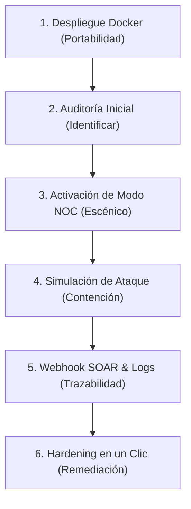

# Guía de Defensa de Título: Estrategia para la Nota Máxima (7.0) — PymeShield

Esta guía detalla la estrategia metodológica, técnica y discursiva para tu presentación ante la comisión evaluadora, asegurando que defiendas el valor de **PymeShield** bajo el estándar de un Ingeniero en Ciberseguridad/Conectividad y Redes.

---

## 1. El Discurso de Apertura: El Problema de las PYMEs y el CESFAM

La comisión evaluadora buscará validar el impacto real de tu proyecto. Tu introducción debe justificar por qué las soluciones tradicionales del mercado no sirven para el segmento objetivo.

### El Argumento Clave:
> *"La ciberseguridad en Chile hoy enfrenta un cambio regulatorio histórico con la Ley N° 21.663. Sin embargo, las pequeñas y medianas empresas (PYMEs), los establecimientos educacionales (colegios y liceos) y los centros de salud familiar (CESFAM) no cuentan con el presupuesto para contratar analistas de seguridad dedicados (SOC) o licencias de software corporativo costosas. PymeShield soluciona esta brecha: democratiza la seguridad perimetral al automatizar tareas complejas de auditoría y contención bajo una interfaz tan intuitiva que puede ser operada por personal administrativo sin conocimientos informáticos (como secretarias, directores o coordinadores de TI locales)."*

---

## 2. El Guion de la Demostración en Vivo (Paso a Paso)

El éxito de la defensa radica en realizar una demostración fluida y estructurada. Sigue esta secuencia técnica para generar el mayor impacto:

### Paso A: Demostración de Portabilidad (Docker)
* **Qué mostrar:** Explica que el sistema está completamente empaquetado en contenedores.
* **Qué decir:** *"Para asegurar que PymeShield sea portable y no requiera configuraciones complejas en los servidores locales del establecimiento (sea una PYME, colegio, liceo o CESFAM), implementamos un empaquetamiento con Docker. El contenedor instala de forma aislada la herramienta nmap y el motor de Node, aislando la base de datos local SQLite mediante un volumen persistente."*

### Paso B: El Mapa de Topología y el Modo Demo
* **Qué mostrar:** Navega a la pestaña de resumen y muestra el **Mapa de Topología SVG**.
* **Qué decir:** *"La comisión observará en pantalla un mapa de topología dinámico que representa la red física LAN. El router principal actúa como nodo central y los hosts clientes orbitan a su alrededor. El color de las líneas de enlace indica el estado del dispositivo en tiempo real basado en el estándar de semáforo de riesgo."*

### Paso C: Activación de Modo NOC e Intrusión (El Clímax del Examen)
* **Qué mostrar:** Enciende el switch **Modo NOC** (la pantalla se volverá rojo neón) y presiona **"Simular Intrusión"**.
* **Qué ocurrirá:** Sonará la alarma acústica sintetizada, aparecerá el nodo rojo del atacante desconectado del router con el icono de calavera, y se generará la alerta.
* **Qué decir:** *"Al simular un ataque con la directiva Zero-Trust (NAC) activa, el sistema realiza tres acciones automáticas inmediatas: primero, la API de Web Audio sintetiza una alarma sonora para alertar físicamente al operador; segundo, se inyecta una regla de bloqueo en el firewall perimetral aislando al host; y tercero, se genera una alerta inmediata."*

### Paso D: Demostración SOAR (Integración Webhook)
* **Qué mostrar:** Abre la pestaña de **Webhook.site** o tu canal de **Discord/Slack** en vivo frente a la comisión y muestra el payload JSON del ataque que acaba de llegar en 1 segundo.
* **Qué decir:** *"PymeShield no trabaja de manera aislada. La telemetría crítica del incidente es despachada en formato JSON a través de un Webhook a la central de seguridad (SOAR/SIEM) de la municipalidad, permitiendo la automatización de la respuesta ante incidentes a gran escala en la nube."*

---

## 3. Respuestas Clave a las Preguntas de la Comisión (FAQ de Defensa)

Los profesores evaluadores intentarán buscar debilidades en la arquitectura. Utiliza estas respuestas técnicas estandarizadas:

### Pregunta 1: ¿Por qué usaron SQLite y no PostgreSQL o MySQL?
* **Respuesta del 7.0:** *"Elegimos SQLite por diseño de portabilidad y arquitectura de borde (Edge computing). PymeShield actúa como un sensor local (appliance) que debe desplegarse con cero configuraciones previas en la PYME, establecimiento educacional (colegio o liceo) o centro de salud primaria (CESFAM). SQLite no requiere credenciales de red de bases de datos, no consume RAM en segundo plano y su base de datos se almacena en un solo archivo físico encriptable, lo cual reduce la superficie de ataque y los recursos necesarios del host local."*

### Pregunta 2: ¿Cómo funciona el escaneo de red en vivo?
* **Respuesta del 7.0:** *"El motor del escaneo es híbrido. Primero, realiza un barrido de pings en paralelo a las 254 IPs de la subred para forzar la actualización de la tabla ARP del sistema operativo. Segundo, lee la tabla ARP del kernel mediante un comando nativo, evitando hacer escaneos ruidosos. Tercero, ejecuta comprobaciones asíncronas de sockets TCP sobre la lista de puertos críticos (22, 80, 443, 445, 3389) para detectar servicios expuestos."*

### Pregunta 3: ¿Qué pasa si el sistema se queda sin internet? ¿Sigue funcionando?
* **Respuesta del 7.0:** *"Sí, en un 100%. El escaneo, la topología SVG, las contenciones NAC en el firewall local, el control de doble factor MFA y la base de datos SQLite funcionan de manera completamente local y fuera de línea. La única característica que requiere salida WAN es el despacho de alertas externas mediante Webhooks."*

### Pregunta 4: ¿Cómo manejan la seguridad de las claves del panel?
* **Respuesta del 7.0:** *"Seguimos las directrices de OWASP. Las contraseñas de acceso nunca se almacenan en texto plano; en su lugar, aplicamos una función hash SHA-256 criptográfica en el servidor. El panel cuenta además con protección MFA real basada en tiempo (TOTP) utilizando el estándar RFC 6238, lo que mitiga ataques de secuestro de sesión y fuerza bruta."*

---

## 4. Alineamiento con el Marco NIST CSF 2.0 y Ley Chilena

Durante tu presentación de diapositivas, asegúrate de mencionar este mapeo directo, el cual da la estructura teórica obligatoria para un proyecto de título de ingeniería:

| Pilar NIST | Función en PymeShield | Cumplimiento Ley N° 21.719 / 21.663 |
| :--- | :--- | :--- |
| **IDENTIFICAR** | Inventario físico de activos y buscador de hosts. | Registro y catastro de infraestructura crítica local. |
| **PROTEGER** | Autenticación SHA-256, Doble Factor (MFA) y scripts de Hardening. | Control de accesos robusto y remediación de puertos. |
| **DETECTAR** | Escaneo periódico automático (cada 3 min) y bitácora de auditoría. | Monitoreo continuo y trazabilidad de eventos anómalos. |
| **RESPONDER** | Aislamiento preventivo Zero-Trust (NAC) mediante reglas de Firewall. | Contención rápida y mitigación de la superficie de ataque. |
| **RECUPERAR** | Plan de recomendaciones detallado paso a paso y reportes PDF CSIRT. | Plan de continuidad de negocio y reportes de cumplimiento. |
